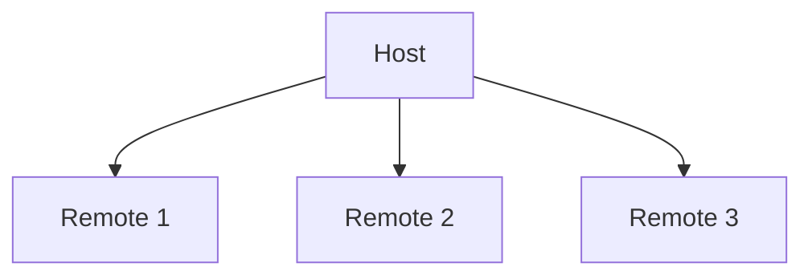

# Module Federation: Key Concepts

  

    <h3 class="text-xl mb-4">Host</h3>
    
Application that consumes federated modules

  

  

    <h3 class="text-xl mb-4">Remote</h3>
    
Application that exposes modules to be consumed

  

  

    <h3 class="text-xl mb-4">Federated Module</h3>
    
Any JavaScript code shared at runtime

  

::right::

