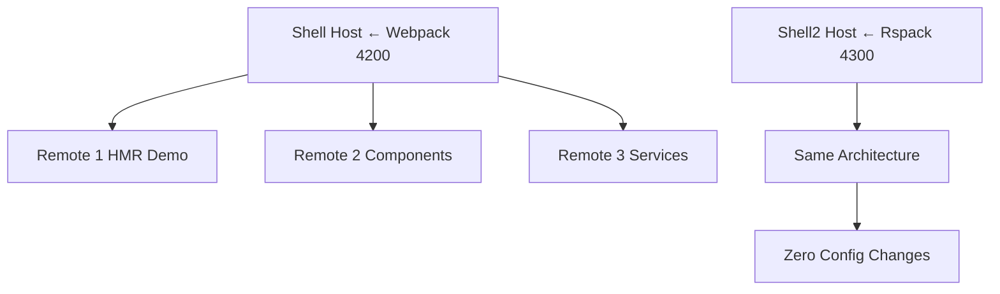

---
---

# What We're Building Today

<h2>Architecture Overview:</h2>

```mermaid {scale: 0.8}
graph TD
    A[Shell Host ← Webpack 4200] --> B[Remote 1 HMR Demo]
    A --> C[Remote 2 Components]
    A --> D[Remote 3 Services]
    E[Shell2 Host ← Rspack 4300] --> F[Same Architecture]
    F --> G[Zero Config Changes]
```

  <h3>💡 Key Point</h3>
  
Same architecture, better performance with Rspack

